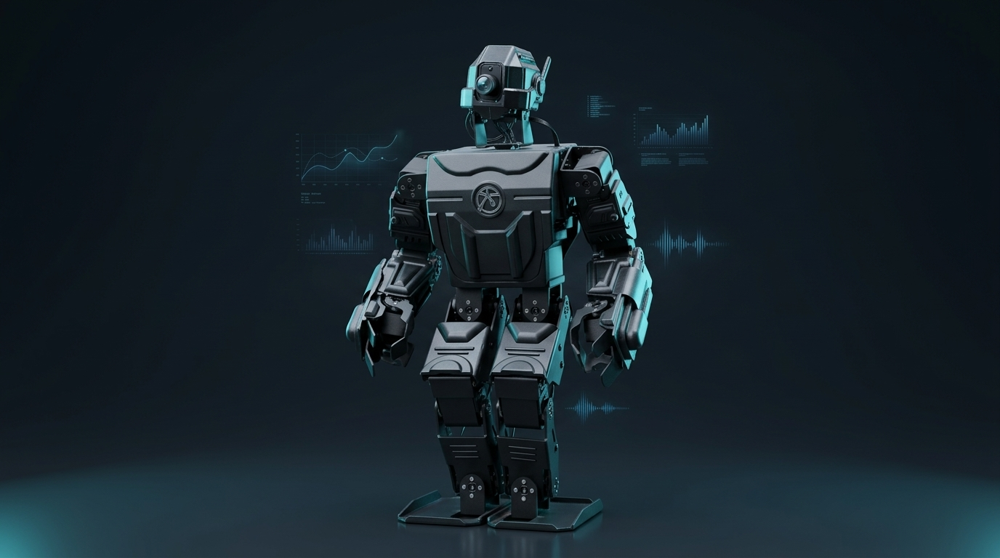
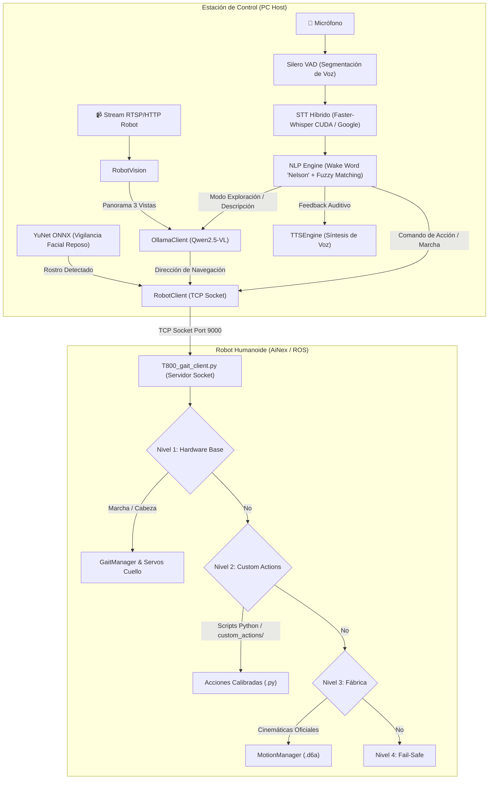

# AiNex Humanoid Autonomous Voice & Vision Control ("Nelson")

[](https://www.python.org/)
[](https://www.ros.org/)
[](https://ollama.ai/)
[](https://github.com/SYSTRAN/faster-whisper)
[](LICENSE)

<p align="center">
  
</p>

Sistema integral de interacción por lenguaje natural, visión computacional con Modelos de Visión-Lenguaje (VLM) y control cinemático para el robot humanoide **Hiwonder AiNex**. Desarrollado en el Centro de Investigación, Desarrollo Tecnológico e Innovación en Inteligencia Artificial y Robótica (**AudacIA**) de la Universidad Simón Bolívar.

---

## Arquitectura del Sistema

El proyecto opera bajo una arquitectura cliente-servidor desacoplada que distribuye la carga de procesamiento entre una estación de trabajo (PC Host con aceleración por GPU) y el sistema embebido del robot (Raspberry Pi con ROS).



---

## Características Principales

1. **Wake Word y Reconocimiento Robusto:**
   - Detección precisa de la palabra clave *"Nelson"* mediante similitud fonética (`RapidFuzz`).
   - Filtrado de ruido y segmentación en tiempo real con **Silero VAD**, evitando procesar silencios.
2. **Transcripción Concurrente y Redundante:**
   - Ejecución paralela en subprocesos de **Faster-Whisper** (CUDA fp16) y **Google Speech Recognition** con fallback automático.
3. **Navegación Visual Autónoma con VLM:**
   - En modo exploración, el robot realiza un barrido panorámico de tres fotos (`izquierda`, `centro`, `derecha`), une la imagen y consulta a **Qwen2.5-VL** vía Ollama para decidir el camino despejado en tiempo real.
4. **Estado Autónomo de Vigilancia Facial:**
   - Tras 45 segundos de inactividad, el robot inspecciona su entorno utilizando **OpenCV YuNet** (<15 ms de inferencia) y saluda automáticamente si detecta una persona.
5. **Despachador Cinemático en Cascada (4 Niveles):**
   - El servidor en el robot (`T800_gait_client.py`) desacopla las órdenes por socket garantizando que nunca se rompa la conexión TCP, delegando entre cinemática inversa nativa y rutinas personalizadas.
6. **Biblioteca de Movimientos Personalizados Calibrados:**
   - Movimientos articulares dinámicos programados de forma nativa en Python (`custom_actions/`): *guardia, victoria, señala, aplauso, pensativo, reverencia, duda, meme 67, levanta la mano*.

---

## Estructura del Repositorio

```text
ainex-voice-ai/
├── pc_client/                     # Código ejecutado en la PC Host (IA, Visión, Audio)
│   ├── main.py                    # Orquestador del sistema concurrente
│   ├── config/                    # Parámetros globales y diccionarios de comandos
│   │   ├── settings.py            # Configuración de IPs, umbrales y modelos
│   │   └── intents.py             # Mapeo canónico de intenciones
│   ├── core/                      # Módulos sensoriales y cognitivos
│   │   ├── audio_capture.py       # Captura de micrófono con Silero VAD
│   │   ├── stt_engine.py          # Transcripción Faster-Whisper / Google
│   │   ├── nlp_engine.py          # Limpieza de texto y clasificación difusa
│   │   ├── tts_engine.py          # Síntesis de voz local
│   │   └── vigilancia_facial_yunet.py # Patrullaje facial con YuNet
│   ├── llm/                       # Cliente de Modelos de Visión-Lenguaje
│   │   └── ollama_client.py       # Interacción HTTP con Ollama (Qwen2.5-VL)
│   ├── robot/                     # Conectividad con el hardware
│   │   ├── robot_client.py        # Cliente TCP Socket con Keep-Alive
│   │   └── vision.py              # Captura de frames de cámara y panoramas
│   └── models/                    # Modelos de inferencia ligeros
│       └── face_detection_yunet_2023mar.onnx
│
├── robot_embedded/                # Componentes que residen en el robot (Ubuntu/ROS)
│   ├── T800_gait_client.py        # Servidor socket con despachador en cascada
│   ├── ainex-gait.service         # Archivo de servicio systemd (inicio automático)
│   └── custom_actions/            # Scripts de movimientos personalizados (.py)
│       ├── guardia.py
│       ├── victoria.py
│       ├── senala.py
│       ├── aplauso.py
│       ├── pensativo.py
│       ├── reverencia.py
│       ├── duda.py
│       ├── meme_67.py
│       └── levanta_mano.py
│
├── docs/                          # Documentación complementaria y cronogramas
│   └── cronograma.png
├── .gitignore                     # Exclusión de binarios pesados y temporales
├── requirements.txt               # Dependencias de Python
└── LICENSE                        # Licencia MIT
```

---

## Instalación y Puesta en Marcha

### Prerrequisitos
- **PC Host:** Windows 10/11 o Linux con Python 3.10+, tarjeta NVIDIA con soporte CUDA (recomendado para Whisper), y [Ollama](https://ollama.ai/) instalado con el modelo `qwen2.5vl:3b`.
- **Robot:** Hiwonder AiNex con Ubuntu 20.04 y ROS Noetic configurado.

### 1. Preparar la PC Host
```bash
# Clonar el repositorio
git clone https://github.com/TU_USUARIO/ainex-voice-ai.git
cd ainex-voice-ai

# Crear y activar entorno virtual
python -m venv .venv
source .venv/bin/activate   # En Windows: .venv\Scripts\activate

# Instalar dependencias
pip install -r requirements.txt

# Iniciar el modelo VLM en Ollama
ollama run qwen2.5vl:3b
```

Configura la dirección IP de tu robot en `pc_client/config/settings.py`:
```python
DIR_IP = '192.168.1.13' # Reemplaza con la IP asignada a tu AiNex
```

### 2. Configurar el Robot AiNex
Transfiere los scripts del robot a la carpeta de control de marcha en la Raspberry Pi:
```bash
scp -r robot_embedded/T800_gait_client.py robot_embedded/custom_actions ubuntu@<IP_DEL_ROBOT>:/home/ubuntu/ros_ws/src/ainex_tutorial/scripts/gait_control/
```

*(Opcional)* Configurar el servicio para que inicie automáticamente al encender el robot:
```bash
ssh ubuntu@<IP_DEL_ROBOT>
sudo cp ainex-gait.service /etc/systemd/system/
sudo systemctl daemon-reload
sudo systemctl enable ainex-gait.service
sudo systemctl start ainex-gait.service
```

### 3. Ejecutar el Sistema
En tu PC Host, ejecuta el orquestador:
```bash
cd pc_client
python main.py
```

---

## Comandos de Voz Soportados

Di siempre **"Nelson"** antes de cada orden:

| Intención | Comandos de Ejemplo | Acción en el Robot |
|---|---|---|
| **Saludar** | *"Nelson, saluda"* / *"Hola Nelson"* | Ejecuta cinemática de saludo de bienvenida |
| **Bailar** | *"Nelson, baila"* / *"Pase del robot"* | Rutina de baile rítmico oficial |
| **Pelear / Guardia** | *"Nelson, a pelear"* / *"En guardia"* | Levanta los brazos en pose de guardia de boxeo con separación |
| **Victoria** | *"Nelson, victoria"* / *"Celebra campeón"* | Eleva ambos brazos en 'V' y festeja mirando arriba |
| **Señalar** | *"Nelson, señala"* / *"Apunta allá"* | Extiende el brazo horizontalmente al frente |
| **Aplauso** | *"Nelson, aplaude"* / *"Bravo"* | Flexiona codos al pecho y aplaude repetidamente |
| **Pensativo** | *"Nelson, piensa"* / *"Pensativo"* | Lleva la mano al mentón e inclina la cabeza |
| **Reverencia** | *"Nelson, reverencia"* / *"Agradece"* | Cruza los brazos al pecho e inclina el cuerpo en respeto |
| **Meme 67** | *"Nelson, haz el 67"* / *"Paso del 67"* | Baile alternado de brazos rítmicos sin chocar |
| **Exploración** | *"Nelson, explora"* / *"Navega"* | Activa navegación visual autónoma con IA |
| **Descripción** | *"Nelson, describe"* / *"¿Qué ves?"* | Toma fotos panorámicas y describe la escena en audio |
| **Parar** | *"Nelson, para"* / *"Detente"* | Parada de emergencia instantánea |

---

## Autores y Reconocimientos

Proyecto desarrollado en el marco de Prácticas Profesionales de Ingeniería de Sistemas:
- **Jhan Hernández Matías** - Desarrollador Líder (Arquitectura de software, cinemática y visión).
- **Andrés Ruz Teran** - Project Manager (Documentación técnica, gestión de requisitos y pruebas).
- **Sergio Vicente Jiménez Martínez** - Tutor de Proyecto.

Institución: **AudacIA** - Centro de Excelencia en Tecnologías Transformadoras de la OEA / Universidad Simón Bolívar, Barranquilla, Colombia.
