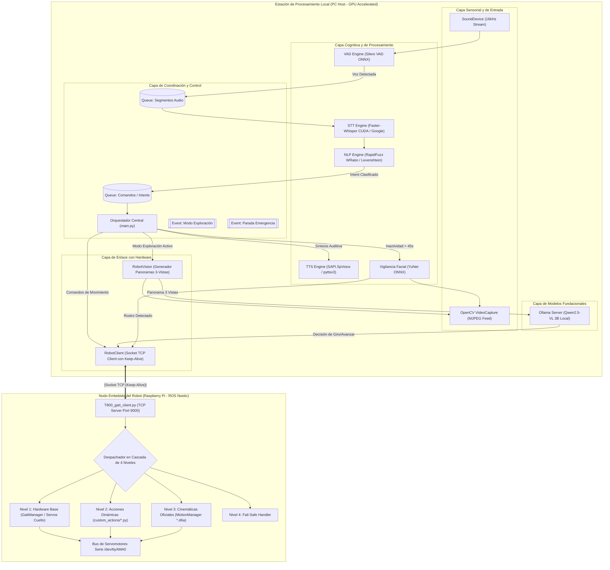
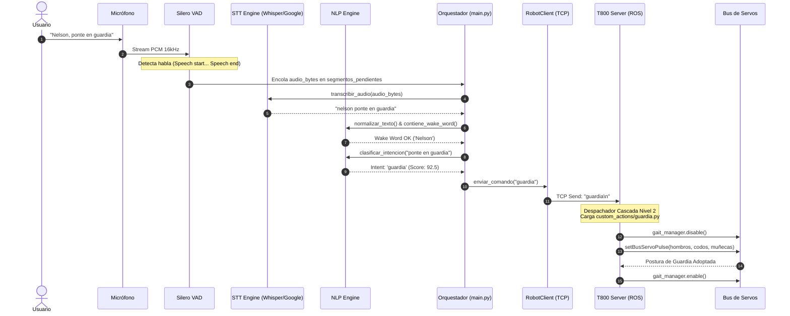
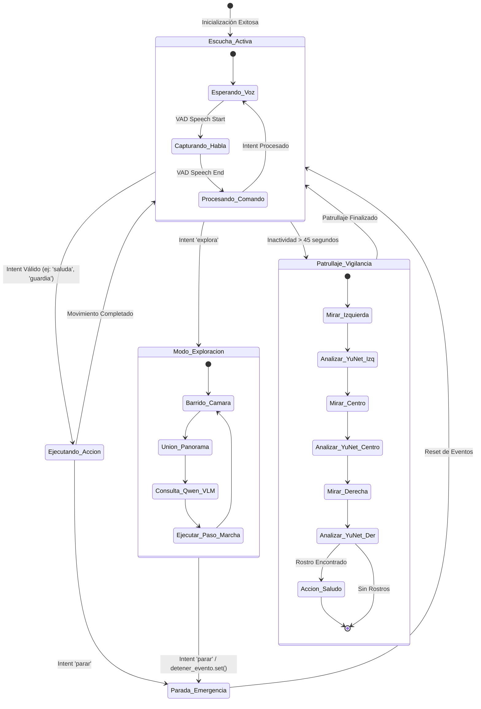

# 🏛️ Arquitectura del Sistema y Diseño de Software

Este documento detalla la arquitectura de software del sistema de interacción por voz y visión para el robot humanoide **AiNex ("Nelson")**, los patrones de diseño implementados, el modelo de concurrencia y los diagramas de interacción entre componentes.

---

## 1. Vista General de la Arquitectura

El sistema implementa una **Arquitectura en Capas Distribuidas (Distributed Layered Architecture)** desacoplada entre dos nodos computacionales principales conectados mediante una red de área local (TCP/IP):



---

## 2. Patrones de Diseño Implementados

### 2.1. Patrón Productor-Consumidor Concurrente (Audio & VAD Pipeline)
Para garantizar que la escucha activa del micrófono **nunca se bloquee ni pierda frames** de audio mientras Whisper realiza inferencias pesadas, se implementó un pipeline desacoplado mediante colas de memoria (`queue.Queue`):
- **Hilo Productor (`AudioCapture`):** Lee chunks de audio de 32 ms a 16 kHz mediante `sounddevice.RawInputStream`. Alimenta los tensores al iterador de **Silero VAD**. Cuando detecta el inicio y fin de una frase de voz, deposita el buffer en `segmentos_pendientes`.
- **Hilo Consumidor (`hilo_procesamiento_voz`):** Extrae los buffers de audio, verifica que no hayan caducado (`MAX_ANTIGUEDAD_SEGMENTO_SEG = 6.0s`) y despacha la transcripción a los motores STT.

### 2.2. Patrón Despachador en Cascada de 4 Niveles (Cascade Dispatcher)
En el servidor del robot (`T800_gait_client.py`), las órdenes entrantes son evaluadas jerárquicamente:
1. **Nivel 1 (Hardware Base y Marcha):** Evalúa comandos directos de marcha en tiempo real (`adelante`, `atras`, `izquierda`, `derecha`, `parar`) y control de posición de cuello (`servo_arriba`, `servo_frente`, `servo_izquierda`, etc.) a través de `GaitManager`.
2. **Nivel 2 (Acciones Personalizadas Dinámicas):** Si el comando coincide con un script en `custom_actions/<comando>.py`, lo importa dinámicamente en tiempo de ejecución con `importlib.util` y ejecuta su función `run(gait_manager, setBusServoPulse, setServoPulse)`.
3. **Nivel 3 (Cinemáticas de Fábrica):** Si no es un script de Python, busca un archivo `.d6a` (base de datos SQLite de secuencias articulares) en `ActionGroups/` y lo delega a `MotionManager.runAction()`.
4. **Nivel 4 (Fail-Safe Graceful Degradation):** Si el comando no existe en ninguno de los niveles anteriores, registra una advertencia en log y responde sin cerrar el socket ni desestabilizar el bus de servos.

### 2.3. Patrón de Fallback Redundante (STT Concurrente)
El motor de transcripción ejecuta simultáneamente:
```python
future_whisper = executor.submit(_intentar_whisper, audio_bytes)
future_google = executor.submit(_intentar_google, audio_bytes)
```
- Se prioriza **Google Speech Recognition** si responde en menos de `GOOGLE_TIMEOUT_SEG = 7.0s` con texto válido.
- Si Google falla o se agota el tiempo por inestabilidad de red, se consume inmediatamente el resultado de **Faster-Whisper** ejecutado en GPU local (`beam_size=1`, búsqueda greedy para mínima latencia).

### 2.4. Inicialización Perezosa (Lazy Initialization)
Para componentes de visión pesados como el modelo **YuNet** de detección facial, la carga del modelo ONNX y la configuración de OpenCV se difieren hasta el momento en que se ejecuta la primera ronda de vigilancia pasiva. Esto optimiza el tiempo de arranque del sistema y previene conflictos de asignación de memoria con los contextos de CUDA de PyTorch.

---

## 3. Diagrama de Secuencia: Procesamiento de Comando de Voz

El siguiente diagrama detalla la interacción paso a paso desde que el usuario emite una orden verbal hasta que el robot la ejecuta físicamente:



---

## 4. Máquina de Estados Finita (FSM) del Sistema

El robot transita entre diferentes estados operacionales gobernados por eventos de concurrencia (`threading.Event`):


