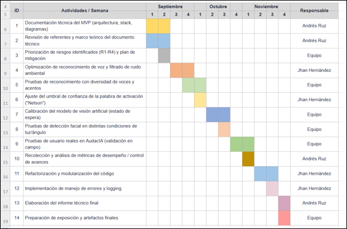

# 📚 Centro de Documentación Técnica — AiNex Voice & Vision AI

Bienvenido a la documentación técnica del sistema de control por voz, visión multimodal e inteligencia artificial para el robot humanoide **Hiwonder AiNex** ("Nelson"), desarrollado en el Centro de Investigación **AudacIA** de la Universidad Simón Bolívar.

Este compendio documental ha sido redactado bajo estándares de ingeniería de software y robótica aplicada para servir como referencia completa a desarrolladores, investigadores y operadores del sistema.

---

## 🗺️ Mapa de la Documentación

| Documento | Descripción | Audiencia Objetivo |
|---|---|---|
| [**1. Arquitectura del Sistema (ARCHITECTURE.md)**](ARCHITECTURE.md) | Desglose arquitectónico, patrones de diseño, diagramas de secuencia UML y máquinas de estado concurrentes. | Arquitectos de Software, Desarrolladores |
| [**2. Cinemática y Hardware (KINEMATICS_AND_HARDWARE.md)**](KINEMATICS_AND_HARDWARE.md) | Mapeo articular de los 24 servomotores, rangos de pulsos, simetría en espejo y guía para crear *Custom Actions*. | Ingenieros Robóticos, Desarrolladores |
| [**3. Protocolo de Comunicación (COMMUNICATION_PROTOCOL.md)**](COMMUNICATION_PROTOCOL.md) | Especificación del protocolo TCP Socket (puerto 9000), Keep-Alive, streaming de video y recuperación de fallos. | Ingenieros de Redes, Desarrolladores |
| [**4. Referencia de API y Módulos (API_REFERENCE.md)**](API_REFERENCE.md) | Documentación técnica de clases, métodos, firmas y parámetros de los motores en `pc_client/`. | Desarrolladores de Software |
| [**5. Guía de Despliegue y Puesta en Marcha (DEPLOYMENT_GUIDE.md)**](DEPLOYMENT_GUIDE.md) | Manual de instalación paso a paso en Ubuntu/ROS, configuración del demonio `systemd` y entorno CUDA/Ollama. | Operadores, Administradores de Sistemas |

---

## 🎯 Resumen Ejecutivo del Proyecto

El sistema dota al robot humanoide AiNex de una interfaz de interacción natural basada en lenguaje hablado y percepción visual autónoma:
- **Procesamiento de Audio Concurrente:** Pipeline desacoplado Productor-Consumidor con detección de actividad de voz (**Silero VAD**) y transcripción híbrida redundante (**Faster-Whisper CUDA** + **Google STT**).
- **Procesamiento de Lenguaje Natural (NLP):** Detección de Wake Word (*"Nelson"*) y clasificación de intención con tolerancia a ruido fonético mediante distancia de Levenshtein ponderada (**RapidFuzz**).
- **Visión Computacional y Modelos Multimodales (VLM):**
  - *Navegación Exploratoria:* Ensamblado panorámico de 3 cuadrantes analizado por **Qwen2.5-VL** vía Ollama local.
  - *Vigilancia Pasiva:* Detección facial ultrarrápida (<15 ms) con **OpenCV YuNet ONNX** tras 45 segundos de inactividad.
- **Control Cinemático Robusto:** Servidor TCP en el robot con despachador en cascada de 4 niveles que ejecuta marcha en tiempo real, poses personalizadas en Python (`custom_actions/`) y cinemáticas oficiales `.d6a`.

---

## 📅 Cronograma y Fases de Desarrollo

El desarrollo se ejecutó siguiendo una metodología ágil incremental adaptada en sprints semanales:

